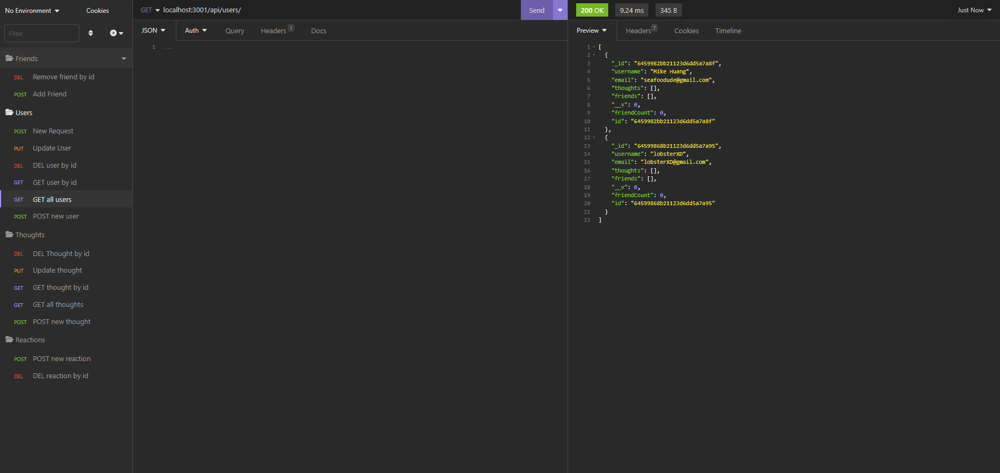

# Pray-Thee-MONGOD

## Description

This Pray-Thee-MONGOD was created for boot camp students who were going through Module 18. It contains a social networking application created through Javescript.

## Table of Contents

* [Installation](#installation)
* [Usage](#usage)
* [License](#license)
* [Screenshots](#screenshots)
* [Tests](#tests)
* [Contributing](#contributing)
* [Questions](#questions)

## Installation

Please install the Insomnia application for the full experience!

`npm i`

## Usage

After copying+cloning the github repo, please type `npm i` into your console to install all necessary packages. Command `node server.js` to run the app on the localhost port.

Make sure you have Insomnia ready!

Please watch the screencastify for more!

## License

[License](#license)

This project is licensed under the MIT license.

## Screenshots

[screencastify](https://drive.google.com/file/d/12A1rkEOeZdroUfxdDCdZ-VISRnNaqC-q/view)

## Tests

N/A

## Questions

Github Profile: [seafoodude](https://github.com/seafoodude)
Email: [seafoodude@gmail.com](seafoodude@gmail.com)

## Contributing

Special thanks to Emma, Big Mike, Patricia, Bryan, and Shawn for guiding me through this experience!